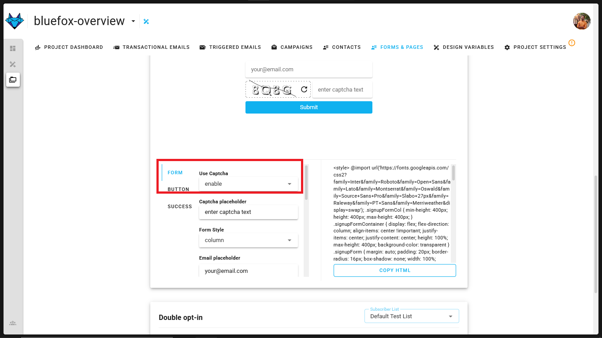

# BlueFox Email React Waitlist Template

## Overview

The BlueFox Email React Waitlist Template  is a complete, production-ready solution I built to help developers and businesses launch a waitlist for their upcoming product or service. As someone who faced challenges while setting up a waitlist for my own project, I wanted to create a tool that simplifies the process without requiring expensive infrastructure or complicated setups. 

This template solves common challenges like email deliverability, spam protection, and seamless integration with BlueFox Email , all while maintaining a modern and responsive design.

### Why Use This Template?

As a developer, I understand how overwhelming it can be to set up a waitlist from scratch. You need to handle things like deliveriblity, email consistency and the hardest part about it coding HTML emails for every other platform, things that can distract you from focusing on your core product. That’s why I built this template:

- **Amazon SES**: Takes care of your deliveribility issue
- **Zero Infrastructure Cost**: Deploy to GitHub Pages for free hosting
- **Professional Design**: Polished UI that looks great on all devices
- **Spam Protection**: Built-in BlueFox CAPTCHA to prevent bot submissions
- **Easy Integration**: Pre-built connection to BlueFox Email's API
- **Developer Experience**: Built with React 19 and Vite for modern development

### Cost Benefits

- **AWS Free tier**: You can send upto 3000 emails in free tier for a year.
- **Free Hosting**: GitHub Pages hosts your waitlist page at no cost
- **Free Email Management**: BlueFox Email provides 3000 free credits monthly for a year
- **Seamless Email Delivery**: Compatible with AWS SES free tier (3000 emails/month for a year)


## Features

- **Modern Design**: Clean, dark-themed UI with gradient accents and smooth animations
- **Responsive Layout**: Fully optimized for all devices from mobile to desktop
- **Form Validation**: Client-side validation for email and required fields
- **BlueFox Email Integration**: Direct API integration with BlueFox Email for subscriber management
- **BlueFox CAPTCHA**: Built-in CAPTCHA system from BlueFox to protect against spam submissions
- **Toast Notifications**: Animated success/error notifications with progress bars
- **GitHub Pages Ready**: Configured for seamless deployment to GitHub Pages
- **TailwindCSS**: Styled with Tailwind for easy customization

## Demo

See it in action: [Live Demo](https://tiwariparth.github.io/Bluefox-ReactJS-free-waitlist-template/)


### Screenshots

<div align="center">
  <strong>Fig: Live deployment of waitlist </strong>
</div>


<div align="center">
  <strong>Fig: Reflected changes in BlueFox Email's contact page </strong>
</div>

## Prerequisites


### BlueFox Email

- **BlueFox Email Account**: For credentials (free tier available). Sign Up [here](https://app.bluefox.email/accounts/create-account)
- **Whitelist your domain**: We need a verified domain to send emails check out [docs](https://bluefox.email/docs/projects/contacts#sign-up-page)
- **API Credentials**: If you plan to use a backend get your API key from [here](https://bluefox.email/docs/api/#the-bluefox-email-api)
>Note: For security reasons, avoid using API credentials in the frontend.

- **Subscriber list URL ID**: get your subscriber list URL from [here](https://bluefox.email/docs/api/subscriber-list-management#subscribe)

Make sure you have:
- **Amazon SES Configured Account**: Checkout this [tutorial](https://bluefox.email/posts/how-to-set-up-aws-ses) to setup Amazon SES
- **Public Repo**: Make sure to have the repository set to public for github pages.
- **Node.js**: Version 18 or higher
- **Package Manager**: PNPM (recommended), NPM, or Yarn
- **Git**: For cloning the repository

## Environment Variables

1. Create a `.env` file in the root of the project with the following variables:
```
VITE_BLUEFOX_SUBLIST_URL=your_subscriber_list_url
```
> Note: To obtain subscriberlist URL with id Check out [here](https://bluefox.email/docs/api/subscriber-list-management)

*For Captcha* go to [Forms and Pages Tab](https://app.bluefox.email/accounts/default-demo/design-systems/67fcf6afda07577ccf8ed13c/projects/67fcf6efda07577ccf8ed375/forms/67fcf6efda07577ccf8ed377#signupFormEditor) and enable the `Use Captcha` option. 



2. Add the same environment variable `VITE_BLUEFOX_SUBLIST_URL` to your GitHub Actions [Secrets and Variables](https://docs.github.com/en/actions/security-guides/using-secrets-in-github-actions) for CI/CD. Follow these steps :

   - Navigate to your repository on GitHub.
   - Go to "Settings" > "Secrets and variables" > "Actions".
   - Click "New repository secret".
   - Add a new secret with the name `VITE_BLUEFOX_SUBLIST_URL` and the value of your subscriber list URL.

> Make sure GitHub Pages is enabled. Check out the steps [here](https://docs.github.com/en/pages/quickstart)

## Installation

1. Clone the repository:
   ```bash
   git clone https://github.com/tiwariParth/Bluefox-ReactJS-free-waitlist-template.git
   cd Bluefox-ReactJS-free-waitlist-template
   ```

2. Install dependencies:
   ```bash
   npm -g install pnpm
   pnpm install
   ```

3. Start the development server:
   ```bash
   pnpm run dev
   ```

4. Open your browser and navigate to the local development URL shown in your terminal.

## Deployment

This project is configured for automatic deployment to GitHub Pages through GitHub Actions. When you push changes to the `main` branch, GitHub Actions will build and deploy your site.

### GitHub Pages Setup

1. Go to your repository settings
2. Navigate to "Pages" section
3. Set the source to "GitHub Actions"
4. Ensure your `vite.config.js` has the correct `base` path that matches your repository name:

   ```js
   base: '/your-repository-name/',
   ```

   This is crucial for assets to load correctly when deployed to GitHub Pages. If you're using a custom domain, you can set `base: '/'` instead.

5. After making any changes to the configuration or environment variables, you'll need to re-run the GitHub Actions workflow:
   - Go to the "Actions" tab in your repository
   - Select the "Deploy to GitHub Pages" workflow
   - Click "Run workflow" and select the branch you want to deploy from (usually main)

This manual trigger ensures your latest configuration changes are applied to the deployment.

### Important Configuration Notes

- The `base` path in `vite.config.js` is set to `/Bluefox-ReactJS-free-waitlist-template/` by default please make sure to change the path with your repository name. 
- When deploying to GitHub Pages under a project repository, this path ensures all assets are loaded correctly.

## Using as a Template Repository

This repository is set up as a template repository, which means you can quickly create a new repository with the same files and structure. To use this template:

1. Click the "Use this template" button at the top of the repository page
2. Create a new repository based on this template
3. After creation, update the following:
   - The `base` path in `vite.config.js` to match your new repository name:
     
     ```js
     base: '/your-new-repository-name/',
     ```
   - Update environment variables both locally and in GitHub Actions secrets

This saves you time by not having to manually fork and clean up a repository.

## Customization

### Form Fields

You can customize the form fields by modifying the state and JSX in `src/App.jsx`.

## Credits

- Created by [Parth Tiwari](https://github.com/tiwariParth)
- Integration with [BlueFox Email](https://bluefoxemail.com/)
