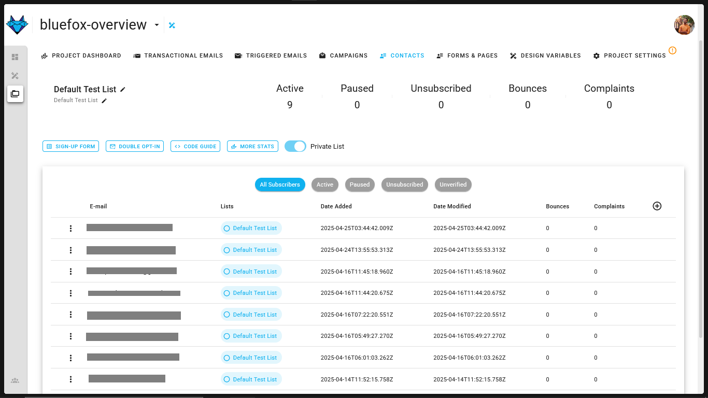

# BlueFox Email React Waitlist Template

## Overview

The BlueFox Email React Waitlist Template is a complete, production-ready solution for launching a waitlist for your upcoming product or service. This template solves the common challenge of collecting and managing early-access user sign-ups without expensive infrastructure or complicated setups.

### Why Use This Template?

- **Zero Infrastructure Cost**: Deploy to GitHub Pages for free hosting
- **Professional Design**: Polished UI that looks great on all devices
- **Spam Protection**: Built-in BlueFox CAPTCHA to prevent bot submissions
- **Easy Integration**: Pre-built connection to BlueFox Email's API
- **Developer Experience**: Built with React 19 and Vite for modern development

### Cost Benefits

- **Free Hosting**: GitHub Pages hosts your waitlist page at no cost
- **Free Email Management**: BlueFox Email provides 3000 free credits monthly for a year
- **Seamless Email Delivery**: Compatible with AWS SES free tier (3000 emails/month for a year)


## Features

- **Modern Design**: Clean, dark-themed UI with gradient accents and smooth animations
- **Responsive Layout**: Fully optimized for all devices from mobile to desktop
- **Form Validation**: Client-side validation for email and required fields
- **BlueFox Email Integration**: Direct API integration with BlueFox Email for subscriber management
- **BlueFox CAPTCHA**: Built-in CAPTCHA system from BlueFox to protect against spam submissions
- **Toast Notifications**: Animated success/error notifications with progress bars
- **GitHub Pages Ready**: Configured for seamless deployment to GitHub Pages
- **TailwindCSS**: Styled with Tailwind for easy customization

## Demo

See it in action: [Live Demo](https://tiwariparth.github.io/Bluefox-ReactJS-free-waitlist-template/)




## Prerequisites


### BlueFox Email

- **BlueFox Email Account**: For credentials (free tier available). Sign Up [here](https://app.bluefox.email/accounts/create-account)
- **Whitelist your domain**: We need a verified domain to send emails check out [docs](https://bluefox.email/docs/projects/contacts#sign-up-page)
- **API Credentials**: If you plan to use a backend get your API key from [here](https://bluefox.email/docs/api/#the-bluefox-email-api)
>Note: We strongly suggest that you should not use API credentials in frontend due to security reasons

- **Subscriber list URL ID**: get your subscriber list URL from [here](https://bluefox.email/docs/api/subscriber-list-management#subscribe)

Make sure you have:
- **Public Repo**: Make sure to have the repository set to public for github pages.
- **Node.js**: Version 18 or higher
- **Package Manager**: PNPM (recommended), NPM, or Yarn
- **Git**: For cloning the repository

## Environment Variables

1. Create a `.env` file in the root of the project with the following variables:
```
VITE_BLUEFOX_SUBLIST_URL=your_subscriber_list_url
```
> Note: To obtain subscriberlist URL with id Check out [here](https://bluefox.email/docs/api/subscriber-list-management)

*For Captcha* go to [Forms and Pages Tab](https://app.bluefox.email/accounts/default-demo/design-systems/67fcf6afda07577ccf8ed13c/projects/67fcf6efda07577ccf8ed375/forms/67fcf6efda07577ccf8ed377#signupFormEditor) and enable the `Use Captcha` option. 


2. As we have a CI with GitHub Actions which will help setting up GitHub Pages for you, make sure that you have added the same environment variable in [Secrets and Variables](https://docs.github.com/en/actions/security-guides/using-secrets-in-github-actions) for the action to run. Follow these steps:

   - Navigate to your repository on GitHub.
   - Go to "Settings" > "Secrets and variables" > "Actions".
   - Click "New repository secret".
   - Add a new secret with the name `VITE_BLUEFOX_SUBLIST_URL` and the value of your subscriber list URL.

> Make sure GitHub Pages is enabled. Check out the steps [here](https://docs.github.com/en/pages/quickstart)

## Installation

1. Clone the repository:
   ```bash
   git clone https://github.com/tiwariParth/Bluefox-ReactJS-free-waitlist-template.git
   cd Bluefox-ReactJS-free-waitlist-template
   ```

2. Install dependencies:
   ```bash
   npm -g install pnpm
   pnpm install
   ```

3. Start the development server:
   ```bash
   pnpm run dev
   ```

4. Open your browser and navigate to the local development URL shown in your terminal.

## Deployment

This project is configured for automatic deployment to GitHub Pages through GitHub Actions. When you push changes to the `main` branch, GitHub Actions will build and deploy your site.

### GitHub Pages Setup

1. Go to your repository settings
2. Navigate to "Pages" section
3. Set the source to "GitHub Actions"

### Important Configuration Notes

- The `base` path in `vite.config.js` is set to `/Bluefox-ReactJS-free-waitlist-template/`. This ensures all assets are correctly loaded when deployed to GitHub Pages under a project repository.
- If you're using this template for your own project, you'll need to update this path to match your repository name:
  ```js
  base: '/your-repository-name/',
  ```
- If you're using a custom domain with GitHub Pages, you can set `base: '/'` instead.

### Using as a Template Repository

This repository is set up as a template repository, which means you can:

1. Click the "Use this template" button at the top of the repository page
2. Create a new repository based on this template
3. After creation, remember to update the `base` path in `vite.config.js` to match your new repository name

## Customization

### Form Fields

You can customize the form fields by modifying the state and JSX in `src/App.jsx`.

## License

This project is licensed under the MIT License - see the LICENSE file for details.

## Credits

- Created by [Parth Tiwari](https://github.com/tiwariParth)
- Integration with [BlueFox Email](https://bluefoxemail.com/)
